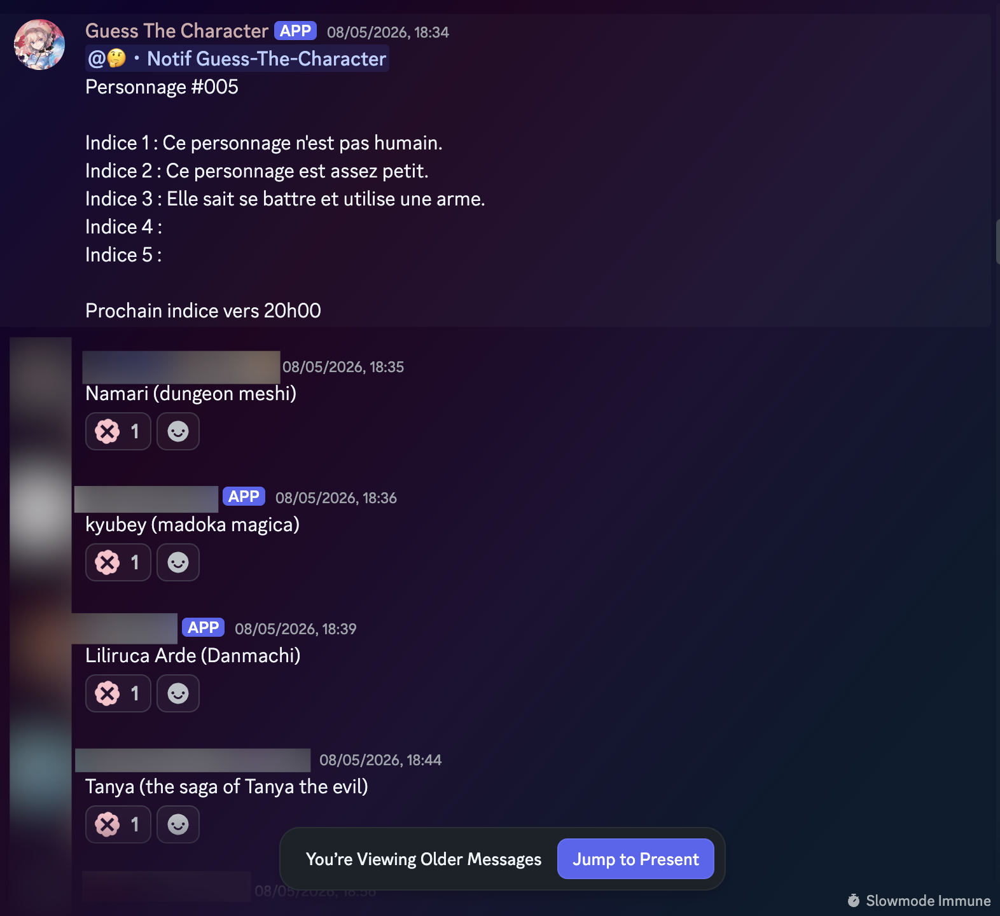
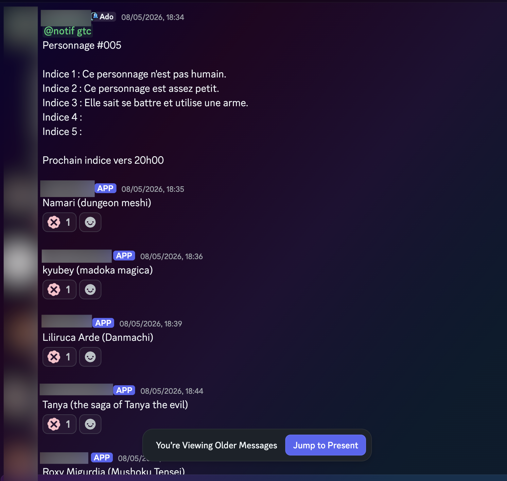
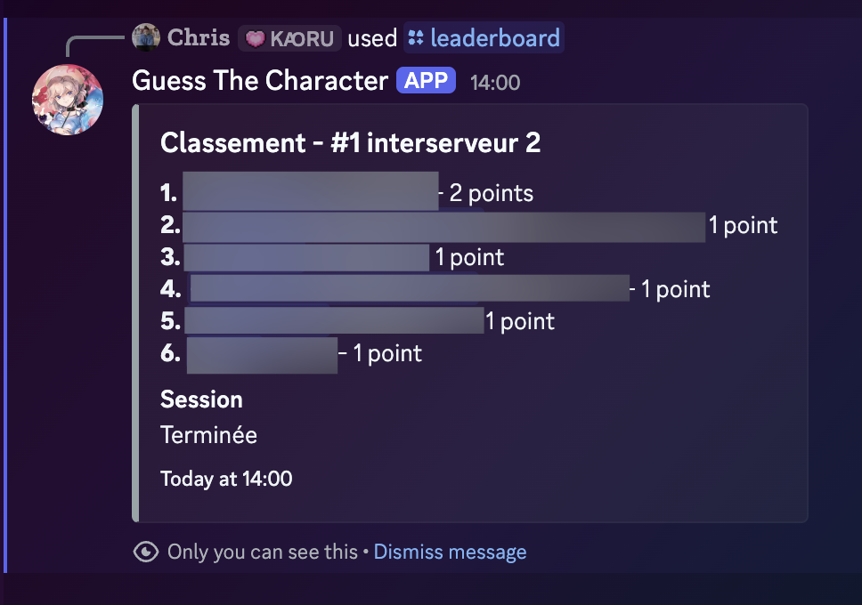

# Guess The Character - Message Content Intent Use Case

This page shows how Guess The Character uses Discord message content during an active game session.

The bot reads message content only in channels explicitly configured by server administrators for a Guess The Character session. The content is used to relay game messages between participating servers, keep edits/deletions/reactions synchronized, and manage game-related features such as points and leaderboards.

Guess The Character does not store raw message text content in its database.

## 1. Organizer Server Message

An organizer posts a game message in the configured session channel on the organizer server. The message contains the character number, hints, and the next hint time.

## 2. Participant Server Relayed Message

The bot relays the organizer's game message to a participating server. In this screenshot, the message appears as sent by Guess The Character because it is the relayed copy in the participant server.

This is why the Message Content intent is required: the bot must read the configured organizer channel message in order to send the same game content to the participating session channels.

## 3. Leaderboard

The bot also provides game commands such as leaderboards. These features use game data such as points, sessions, users, and participation records.

## Data Handling Summary

- Message content is read only in configured game channels during active sessions.
- Raw message text content is not stored in the database.
- Technical message metadata is retained for 30 days.
- Message content is not used for advertising, profiling, scraping, resale, or AI/ML training.
